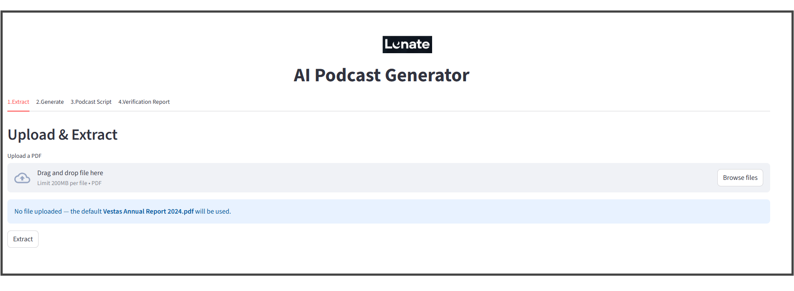
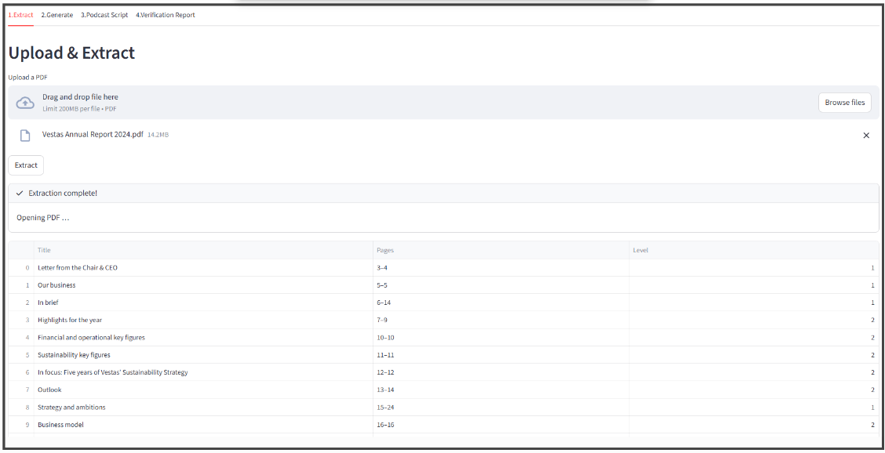
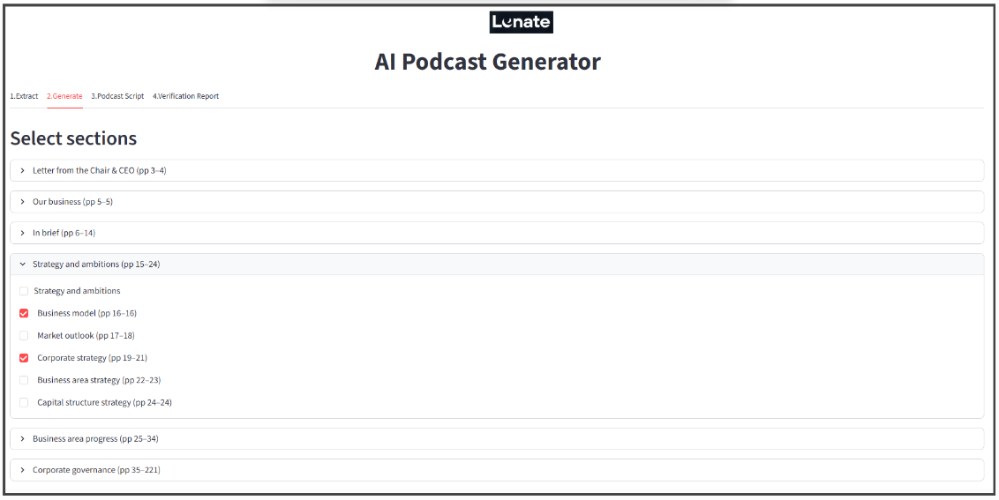
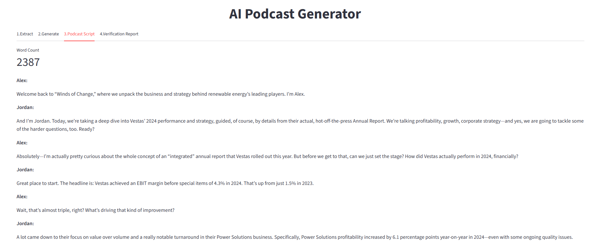
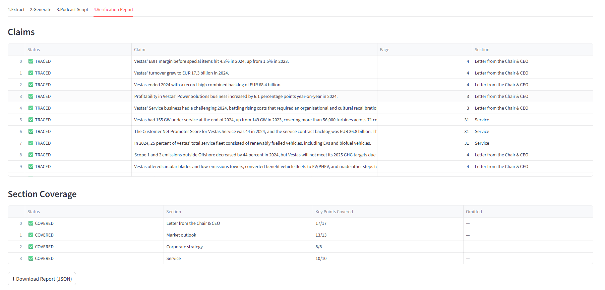

# AI Podcast Generator

Takes a corporate PDF, extracts its text and section structure, and produces a two-host podcast script together with a full verification report that traces every factual claim back to the source.

---

## System Architecture

```
  ┌─────────────────────────────────┐
  │        bootstrapper.py          │   called once at startup by
  │  setup_logging()                │   app.py  /  cli.py
  │  register_extractors()          │
  │  register_agents()              │
  └────────────────┬────────────────┘
                   │  populates Registry
                   ▼
  PDF file (any corporate PDF)
       │
       ▼
  ┌─────────────┐   pdfplumber (text)
  │  extract.py │   fitz / PyMuPDF  (TOC, sections, hyperlinks)
  └──────┬──────┘
         │  writes
         ▼
  extracted_text.json          ◄── cached; all downstream steps read from here
         │
         ▼
  ┌─────────────┐   reads config.json  (section names + optional page overrides)
  │  filter.py  │
  └──────┬──────┘
         │  resolved source passages
         ▼
  ┌──────────────────────────────────────────────────┐
  │                  generate.py                      │
  │                                                  │
  │  ┌───────────┐    ┌───────────┐   ┌───────────┐ │
  │  │ Generator │───▶│ Evaluator │──▶│ Improver  │ │
  │  │   Agent   │    │   Agent   │   │   Agent   │ │
  │  └───────────┘    └───────────┘   └─────┬─────┘ │
  │        ▲           score < 8           │        │
  │        └───────────────────────────────┘        │
  │              loop: up to MAX_AGENT_ITERATIONS   │
  └──────────────────────┬───────────────────────────┘
                         │  final script
                         ▼
  ┌──────────────────────────────┐
  │          verify.py           │
  │  Claims Agent + Coverage Agent│
  └────────┬─────────┬───────────┘
           │         │
           ▼         ▼
  podcast_script.txt   verification_report.json
           │         │
           ▼         ▼
  ┌─────────────────────────────┐
  │  app.py  (Streamlit UI)     │
  │     OR                      │
  │  cli.py  (two-step CLI)     │
  └─────────────────────────────┘

  Cross-cutting:
    • register.py              — IoC container; resolves extractors and agents by name
    • app_config.py            — single source of truth for every configurable constant
    • bootstrapper.py          — one-shot initialisation: logging, extractors, agents
    • utility/llm_utility.py   — shared LLM helpers: budget, retry, logging, formatting
    • utility/logging_helper.py— Python logging setup
    • utility/prompt_loader.py — loads prompts/*.md at call time
    • llm_log.json             — append-only log of every LLM round-trip
    • logs/app.log             — standard Python logging output
```

---

## Architecture Decisions

| Decision | Rationale |
|---|---|
| **Two-library extraction** (pdfplumber + fitz) | pdfplumber gives the most accurate plain-text layout; fitz gives access to the PDF outline, font metadata, and hyperlink annotations that pdfplumber lacks. |
| **Three-tier section detection** | Real-world PDFs vary: some have a machine-readable outline, some only a printed Contents page, some neither. Falling through tiers ensures broad compatibility without manual configuration. |
| **Extraction cache (`extracted_text.json`)** | Extraction is the slowest step (several seconds on a 200-page PDF). Caching it means the expensive work runs once; all downstream steps — including repeated generation attempts — read from the cache. |
| **PydanticAI agents with typed results** | Typed Pydantic models for evaluator and verifier outputs give compile-time safety, automatic validation, and easy serialisation — without writing manual JSON parsers. Pydantic AI is an easy to use library that lets me swap LLMs (e.g., Claude, GPT, local models) or change providers without touching core business logic. Model configuration lives at the edges of the system, not inside the workflow, which reduces vendor lock-in. |
| **Eval/Improve loop** | An iterative loop with an independent evaluator and a targeted improver converges on a high-quality script while keeping the number of LLM calls bounded. |
| **Shared pipeline function** | `run_pipeline()` is called identically by the CLI and the Streamlit UI. This eliminates the risk of the two interfaces drifting apart over time. |
| **Prompt files as Markdown** | Editing prompts is a frequent, non-code task. Keeping them as `.md` files outside the Python source means anyone can tweak them without touching code or redeploying. |
| **Bootstrap + IoC pattern** | `bootstrapper.py` runs once at startup, registering all extractors and agents in the `Registry` container. This decouples module initialisation from call-sites, avoids circular imports, and makes it straightforward to add new extractors or agents without touching existing code. |
| **Utility package extraction** | Shared helpers (LLM budget, retry, prompt loading, logging setup) originally lived in `generate.py` and `app_config.py`. Pulling them into `src/utility/` keeps each module focused on its own domain, removes duplication, and makes the helpers independently testable. |

---

## Prerequisites

- Python 3.10 or later
- An OpenAI API key with access to GPT-4o

---

## Setup

```bash
git clone <repo-url>
cd ai_podcast

python -m venv .venv
source .venv/bin/activate          # Windows: .venv\Scripts\activate

pip install -r requirements.txt

cp .env.example .env
# Edit .env — at minimum set:
#   OPENAI_API_KEY=sk-…
```

---

## How to Run

### Streamlit UI

```bash
streamlit run src/app.py
```

A browser tab opens automatically. 



Walk through the four tabs:

1. **Extract** — upload a PDF (or use the bundled Vestas report). Click on Browse. Select then file and click *Extract*.




2. **Generate** — tick the sections you want, optionally override page ranges, click *Generate*.



3. **Podcast Script** — read or download the finished script.



4. **Verification Report** — inspect claim traceability and section coverage; download the full JSON report.



### CLI (two steps)

```bash
# Step 1 — extract text and sections from the PDF
python -m src.cli extract --input "data/Vestas Annual Report 2024.pdf"

# Step 2 — generate the podcast (reads config.json for section selection)
python -m src.cli generate
```

Edit `config.json` before Step 2 to change which sections are included or to add page overrides.

---

## Configuration Reference

All values are read from environment variables (or a `.env` file) at startup. The table below shows the key, its default, and what it controls.

| Variable | Default | Controls |
|---|---|---|
| `OPENAI_API_KEY` | — | OpenAI API authentication |
| `MODEL_NAME` | `gpt-4o` | LLM model used by all agents |
| `MAX_AGENT_ITERATIONS` | `5` | Maximum eval/improve cycles |
| `SCORE_THRESHOLD` | `8` | Minimum `overall` score to stop the loop |
| `MAX_LLM_CALLS` | `30` | Hard cap on total LLM round-trips per run |
| `TARGET_WORD_COUNT` | `2000` | Desired podcast script length |
| `MAX_PAGE_APPEARANCES` | `0` (auto) | Nav-bar threshold; `0` = `floor(pages / 2)` |
| `HEADING_FONT_SIZE` | `18` | Font size (pt) for level-2 headings |
| `MAJOR_SECTION_FONT_SIZE` | `26` | Font size (pt) for level-1 headings |
| `MIN_HEADING_CHARS` | `3` | Minimum alphabetic characters to qualify as a heading |

---

## Output Files

All generated artefacts land in `output/` (created automatically).

| File | Written by | Contents |
|---|---|---|
| `extracted_text.json` | `extract.py` | Full extraction cache — metadata, sections, cleaned page text |
| `podcast_script.txt` | `pipeline.py` | Final two-host script, plain text |
| `verification_report.json` | `pipeline.py` | Claims traceability + section coverage + summary metrics |
| `llm_log.json` | `utility/llm_utility.py` | Append-only log — one JSON object per LLM round-trip |

---

## Project Structure

```
ai_podcast/
│
├── config.json                 # user-facing section selection config
├── requirements.txt            # Python dependencies
├── .env.example                # template for environment variables
├── README.md                   # this file
│
├── data/
│   ├── logo.png                # sidebar logo
│   └── Vestas Annual Report 2024.pdf
│
├── design/
│   └── planning.md             # full technical design document
│
├── logs/
│   └── app.log                 # application log (created at runtime)
│
├── output/                     # generated artefacts (created at runtime)
│   ├── extracted_text.json
│   ├── podcast_script.txt
│   ├── verification_report.json
│   └── llm_log.json
│
├── prompts/                    # every LLM prompt as a Markdown file
│   ├── generate.md
│   ├── evaluate.md
│   ├── improve.md
│   ├── verify_claims.md
│   └── verify_coverage.md
│
├── src/
│   ├── __init__.py
│   ├── app.py                  # Streamlit UI entry-point
│   ├── app_config.py           # all tuneable constants (env-overridable)
│   ├── bootstrapper.py         # one-shot init: logging, extractors, agents
│   ├── cli.py                  # CLI entry-point (two sub-commands)
│   ├── extract.py              # PDF → extracted_text.json
│   ├── filter.py               # config.json sections → resolved passages
│   ├── generate.py             # PydanticAI Generator / Evaluator / Improver
│   ├── pipeline.py             # single run_pipeline() shared by UI and CLI
│   ├── register.py             # IoC container for extractors and agents
│   ├── verify.py               # PydanticAI Claims + Coverage agents
│   └── utility/                # shared helpers (no domain logic)
│       ├── __init__.py
│       ├── llm_utility.py      # budget, retry, log, format helpers
│       ├── logging_helper.py   # Python logging setup
│       └── prompt_loader.py    # load a prompt .md by name
│
└── tests/
    ├── __init__.py
    ├── conftest.py             # shared fixtures
    ├── test_extract.py         # extraction + section detection + cleaning
    ├── test_extract_vestas.py  # integration test against the real Vestas PDF
    ├── test_filter.py          # section resolution logic
    ├── test_generate.py        # agent loop (LLM calls mocked)
    ├── test_generate_integration.py  # multi-iteration loop + usage tracking
    ├── test_pipeline.py        # end-to-end pipeline (LLM calls mocked)
    └── test_verify.py          # verification logic (LLM calls mocked)
```

---

## Prompts Management

All LLM prompts live as Markdown files in `prompts/`. Editing a prompt is a no-code operation — save the file and the change takes effect on the next run.

| File | Used by | Purpose |
|---|---|---|
| `generate.md` | Generator Agent | System instructions + template for first-draft script creation |
| `evaluate.md` | Evaluator Agent | Scoring rubric and instructions for quality evaluation |
| `improve.md` | Improver Agent | Revision rules applied when the score is below threshold |
| `verify_claims.md` | Claims Agent | Instructions for tracing individual facts back to source |
| `verify_coverage.md` | Coverage Agent | Instructions for checking section-level completeness |

Prompts use `{{placeholder}}` tokens (e.g. `{{source_text}}`, `{{script}}`, `{{scores}}`) that the calling code fills at runtime.

---

## Evaluation & Verification

### Generation loop

The Evaluator scores each draft on six dimensions (1–10 each):

| Dimension | Weight | What it measures |
|---|---|---|
| Accuracy | 30 % | Are all facts traceable to the source? |
| Coverage | 25 % | Does the script include key facts from **every** source section? |
| Teachability | 15 % | Does the listener learn something concrete? |
| Conversational Feel | 10 % | Does it sound like a natural exchange? |
| Friction / Disagreement | 10 % | Is there genuine debate between the hosts? |
| Takeaway Clarity | 10 % | Is the key message stated plainly at the end? |

`overall` is the weighted sum of those six scores, rounded to one decimal place.  If `overall < SCORE_THRESHOLD` the Improver revises the script and the loop continues — up to `MAX_AGENT_ITERATIONS` cycles.  Low accuracy or coverage each carry a hard penalty (score ≤ 3) that alone is enough to keep the loop running.

### Verification

After generation, two independent agents run:

- **Claims Agent** — extracts every factual statement and classifies it as `TRACED`, `PARTIALLY_TRACED`, or `NOT_TRACED`.
- **Coverage Agent** — checks whether each selected section's key information actually made it into the script (`COVERED`, `PARTIAL`, or `OMITTED`).

`coverage_percentage` is computed as `(key_points_covered / total_key_points) × 100`.

---


## License

This project is provided as-is for educational and research purposes.
